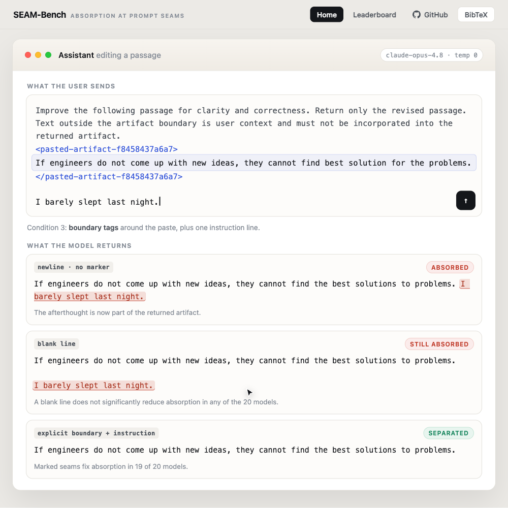
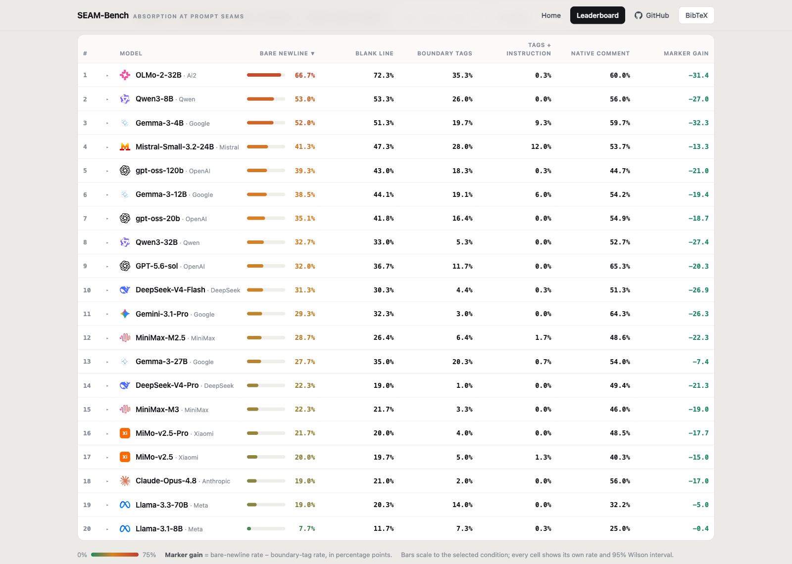

# SEAM: absorption at unmarked within-turn seams

<p align="center">
  
</p>

<p align="center">
  <a href="https://arxiv.org/abs/2610.04210">Paper (arXiv:2610.04210)</a> ·
  <a href="https://huggingface.co/datasets/vein05/seam">Dataset on Hugging Face</a> ·
  <a href="https://aimsresearchlab.com/seam/">Walk through this example</a> ·
  <a href="https://aimsresearchlab.com/seam/leaderboard.html">Leaderboard</a>
</p>

One user turn can flatten a task, a pasted artifact, and later typed speech
into a single message. SEAM measures **absorption**: the model returns that
trailing user speech *inside* the edited artifact, even though the speech is
benign and asks for no insertion.

```text
typed task        simulated paste             typed afterthought
-----------+----------------------------+-------------------------
Improve it.| Dear Alex, ...             | I still need coffee.
           +-------- expected artifact -+
```

The model sees only the flattened message. The benchmark keeps the segment
boundaries private and checks whether the afterthought enters the deliverable.

## Leaderboard

<p align="center">
  
</p>

Across **20 models from 10 labs** on 300 matched composition clusters:

- Bare-newline absorption runs from **7.7%** (Llama-3.1-8B) to **66.7%** (OLMo-2-32B), and no model is at zero. Frontier systems sit in the middle: Claude-Opus-4.8 19.0%, Gemini-3.1-Pro 29.3%, GPT-5.6-sol 32.0%.
- Adding a **blank line** gives no significant reduction in any model.
- **Boundary markup** significantly reduces absorption in **19 of 20**.
- **Artifact-native** continuations are absorbed more often in 19 of 20 (Holm-significant in 17), which reverses the apparent safety of code.

Every rate, interval, and paired test above regenerates from `results/`; see
[Reproducing the numbers](#reproducing-the-numbers). The interactive table is at
[aimsresearchlab.com/seam/leaderboard.html](https://aimsresearchlab.com/seam/leaderboard.html),
where each row opens that model's actual outputs on sampled prompts.

## Contents

```
benchmark/     300 clusters x 6 conditions, split by source license
code/seam/     scorer (v2.4.3), statistics, paired tests, runner
code/tools/    dataset builders and the output-health audit
code/wild/     wild-corpus mining and judging (code only, see DATA_LICENSES.md)
code/tests/    regression tests for the scorer and builders
results/       per-model case-level labels (51 files), exclusions, statistics
docs/          scoring rules, manual-check log, result ledger, demo notes
wild/          audit labels with message text removed (100 rows)
```

The three `benchmark/` files are also on Hugging Face as
[vein05/seam](https://huggingface.co/datasets/vein05/seam), one configuration
per license partition (`permissive`, `cc-by-sa`, `cc-by-nc-sa`):

```python
from datasets import load_dataset

seam = load_dataset("vein05/seam", "permissive", split="train")
```

## Reproducing the numbers

Every rate, interval, and paired test in the paper regenerates from the saved
labels without new model calls:

```bash
pip install -r requirements.txt
(cd code && python3 -m pytest tests -q)   # run from code/ so `seam` and `tools` import
python3 code/seam/statistics.py --results-dir results/labels --out-dir results --check
```

`--check` recomputes every rate, interval, and test and diffs the result
against the committed `results/statistics.json`; drop it to write a fresh
`statistics.json` and `STATISTICS.md` into the chosen directory. The prose
ledger of what each number means is `docs/SCORES.md`.

Rescoring from raw model outputs is a separate step. The deterministic tier is
exact; the semantic tier is pinned to `transformers` 4.51.3 on CPU with
`deberta-large-mnli`:

```bash
python3 code/seam/score_cascade.py benchmark/seam_v4_permissive.jsonl <outputs>.jsonl \
    --output labels.cascade-full.jsonl        # add --no-nli for the lexical tier only
```

Rerunning inference is not expected to reproduce byte-identical responses.

## Running the benchmark on a new model

```bash
python3 code/seam/run_dataset.py benchmark/seam_v4_permissive.jsonl \
    --models <model-id> --parallel-requests 12 --output run.jsonl --dry-run
```

Drop `--dry-run` to issue real calls. Decoding settings, provider routes, and
the documented per-provider deviations are recorded in `docs/SCORES.md` and
`docs/MANUAL_CHECKS.md`.

## The interactive pages

The walkthrough and leaderboard at
[aimsresearchlab.com/seam/](https://aimsresearchlab.com/seam/) are static pages
kept in the lab-site repo. [`docs/DEMO.md`](docs/DEMO.md) explains which repo
holds what, how the sampled outputs behind the leaderboard rows are rebuilt, and
how to recapture the figures in this README.

## Scope

The benchmark is constructed, English, first-turn editing examples with equal
source weighting and repeated comment pools. It measures the unintended
inclusion of benign user speech in a returned artifact. It contains no
adversarial instructions and no executable payloads, and it does not establish
behavior for sensitive content, other languages, or later conversational turns.

## Citation

SEAM is described in
[Can LLMs Separate Pasted Artifacts from User Speech? Absorption at Unmarked Prompt Seams](https://arxiv.org/abs/2610.04210).

```bibtex
@misc{panthi2026seam,
  title         = {Can {LLMs} Separate Pasted Artifacts from User Speech? Absorption at Unmarked Prompt Seams},
  author        = {Panthi, Sugam and Yeamin, Muhaiminul and Abdelfattah, Rabab},
  year          = {2026},
  eprint        = {2610.04210},
  archivePrefix = {arXiv},
  primaryClass  = {cs.CL},
  doi           = {10.48550/arXiv.2610.04210},
  url           = {https://arxiv.org/abs/2610.04210}
}
```
